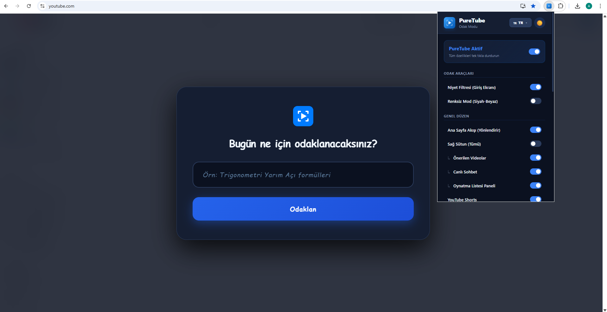

  
  <h1>PureTube: YouTube Focus and Willpower Assistant</h1>
  
<a href="README.md"> Türkçe Oku</a> |  Read in English

We are the PureTube Team. We developed this project for the TEKNOFEST 2026 Technology for Humanity competition.

It has happened to all of us: We go to YouTube to watch a math lecture or do research, but the algorithm catches us so well that an hour later we find ourselves scrolling through Shorts videos one after another. We coded PureTube exactly to solve this "digital distraction" and transform YouTube solely into a learning center.

   
  
    

  <h2>The Engineering and Logic Behind the Project</h2>

We didn't want to make a simple extension that just says "hide this, block that". While writing the codes, we tried to include some psychology and modern software architecture:

<ul>
  <li><b>Intent Filter:</b> When you open YouTube, the site doesn't load immediately. You have to write your "intent" (e.g., derivative question solution) on the blurred screen that appears. The system does a small analysis in the background; if it detects entertainment words like games, series, cats, or random keystrokes like "asdf", it doesn't let you in.</li>
  
  <li><b>Willpower Lock:</b> Let's say you get bored while studying and decide to turn off the extension to watch Shorts. PureTube doesn't allow this immediately. When you want to flip the switch, a lock window appears on the screen and asks you to type the sentence "I accept breaking my focus" completely. This small obstacle, called "Cognitive Friction", makes the user question their impulsive decision at that moment.
      
    

      
    

     
  </li>
  
  <li><b>Accessibility and Dopamine Control:</b> We added a special font option with adjusted letter and word spacing for users with dyslexia (reading difficulty). Also, if you want, you can turn YouTube completely into black and white format; this way, the dopamine release created by bright colors in the brain decreases, making the platform "boring" but suitable for its main purpose.
      
    

      
    

     
  </li>
  
  <li><b>Global Scalability (i18n API):</b> We didn't embed a single static text into the codes. By using Chrome's i18n API, we made the system responsive to Turkish, English, Spanish, and German languages. The extension works in whatever language your browser is in.
      
    

      
    

     
  </li>
</ul>

  <h2>How Can You Test It in Your Own Browser?</h2>

Installation is very simple for our jury members or developers who want to examine the code:

<ol>
  <li>Download the project to your computer by clicking the green <b>"Code"</b> button on the top right of this page and then <b>"Download ZIP"</b>, and extract it to a folder.</li>
  <li>Open Google Chrome and type <b>chrome://extensions/</b> into the address bar.</li>
  <li>Turn on <b>"Developer mode"</b> from the top right.</li>
  <li>Click the <b>"Load unpacked"</b> button on the top left and select the folder you downloaded.</li>
  <li>Pin PureTube from the extensions menu (puzzle icon) on the top right. Now you can go to YouTube and test it!</li>
</ol>

<i>This open-source project is coded to transform technology into a tool that allows us to manage our time, rather than a tool that steals it.</i>
