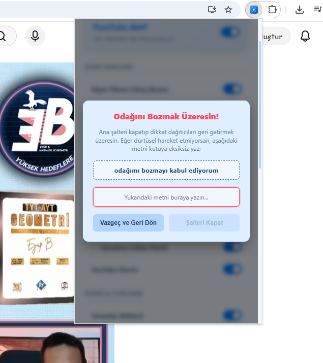
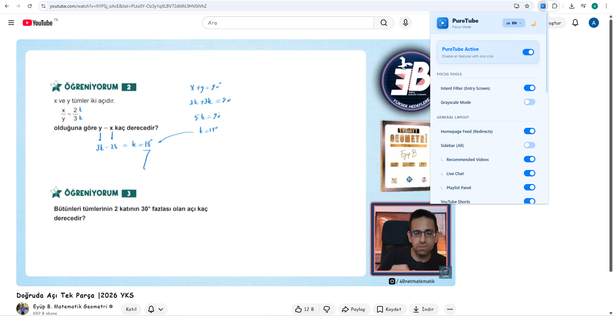

  
  <h1>PureTube: YouTube Odak ve İrade Asistanı</h1>

Biz PureTube Ekibiyiz. Bu projeyi TEKNOFEST 2026 İnsanlık Yararına Teknolojiler yarışması için geliştirdik.

Hepimizin başına mutlaka gelmiştir: YouTube'a bir matematik konu anlatımı izlemek veya araştırma yapmak için gireriz ama algoritma bizi öyle bir yakalar ki, bir saat sonra kendimizi arka arkaya Shorts videoları kaydırırken buluruz. PureTube'u tam olarak bu "dijital dikkat dağınıklığını" çözmek ve YouTube'u sadece bir öğrenme merkezine dönüştürmek için kodladık.

   
  
    

  <h1>Projenin Arkasındaki Mühendislik ve Mantık</h1>

Sadece "şunu gizle, bunu kapat" diyen basit bir eklenti yapmak istemedik. Kodları yazarken işin içine biraz psikoloji ve modern yazılım mimarisi katmaya çalıştık:

<ul>
  <li><b>Niyet Filtresi:</b> YouTube'u açtığınızda site hemen yüklenmez. Karşınıza çıkan puslu ekrana o anki "niyetinizi" (örn: türev soru çözümü) yazmanız gerekir. Sistem arka planda küçük bir analiz yapar; oyun, dizi, kedi gibi eğlence kelimelerini veya "asdf" gibi rastgele tuşlamaları tespit ederse içeri girmenize izin vermez.</li>
  
  <li><b>İrade Kilidi:</b> Diyelim ki ders çalışırken sıkıldınız ve eklentiyi kapatıp Shorts izlemeye karar verdiniz. PureTube buna hemen izin vermiyor. Şalteri indirmek istediğinizde ekrana bir kilit penceresi geliyor ve "odağımı bozmayı kabul ediyorum" cümlesini eksiksiz yazmanızı istiyor. "Bilişsel Sürtünme" denilen bu küçük engel, kullanıcının o anki dürtüsel kararını sorgulamasını sağlıyor.
      
    

      
    

     
  </li>
  
  <li><b>Erişilebilirlik ve Dopamin Kontrolü:</b> Koda disleksi (okuma güçlüğü) yaşayan kullanıcılar için harf ve kelime aralıkları ayarlanmış özel bir font seçeneği ekledim. Ayrıca isteyenler YouTube'u tamamen siyah-beyaz formata çevirebiliyor; böylece parlak renklerin beyinde yarattığı dopamin salınımı azalarak platform "sıkıcı" ama asıl amacına uygun hale geliyor.
      
    

      
    

     
  </li>
  
  <li><b>Global Ölçeklenebilirlik (i18n API):</b> Kodların içine tek bir sabit metin bile gömmedik. Chrome'un i18n API'sini kullanarak sistemi Türkçe, İngilizce, İspanyolca ve Almanca dillerine duyarlı hale getirdik. Tarayıcınız hangi dildeyse eklenti o dilde çalışıyor.
      
    

      
    

     
  </li>
</ul>

  <h1>Kendi Tarayıcınızda Nasıl Test Edebilirsiniz?</h1>

Jüri üyelerimiz veya kodu incelemek isteyen geliştiriciler için kurulum çok basit:

<ol>
  <li>Bu sayfanın sağ üstündeki yeşil <b>"Code"</b> butonuna tıklayıp <b>"Download ZIP"</b> diyerek projeyi bilgisayarınıza indirin ve bir klasöre çıkartın.</li>
  <li>Google Chrome'u açıp adres çubuğuna <b>chrome://extensions/</b> yazın.</li>
  <li>Sağ üstten <b>"Geliştirici Modu"nu</b> (Developer mode) açın.</li>
  <li>Sol üstteki <b>"Paket açılmamış öğe yükle"</b> (Load unpacked) butonuna tıklayıp indirdiğiniz klasörü seçin.</li>
  <li>Sağ üstteki uzantılar menüsünden (yapboz ikonu) PureTube'u sabitleyin. Şimdi YouTube'a girip test edebilirsiniz!</li>
</ol>

<i>Bu açık kaynaklı proje, teknolojiyi zamanımızı çalan değil, zamanımızı yönetmemizi sağlayan bir araca dönüştürmek amacıyla kodlanmıştır.</i>
